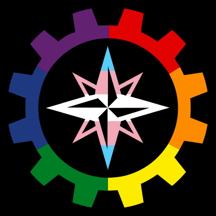
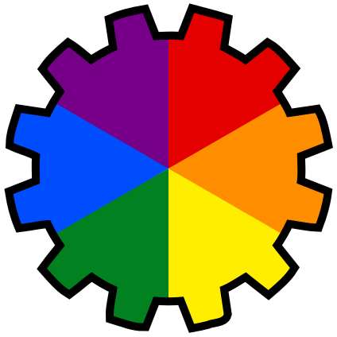
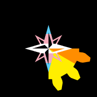
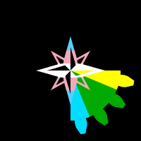

# LGBTESCREAL

SVG files for an "LGBTESCREAL" symbol.

LGBTESCREAL is a fusion of the acronyms [LGBT](https://en.wikipedia.org/wiki/LGBTQ) and [TESCREAL](https://en.wikipedia.org/wiki/TESCREAL).

The symbol consists of the [LessWrong](https://www.lesswrong.com/) logo compass in [trans flag](https://en.wikipedia.org/wiki/Transgender_flag) colors, within a [rainbow](https://en.wikipedia.org/wiki/Rainbow_flag_(LGBTQ)) gear, on a black background.

The symbol was originally designed by @tetraspace, @dawnlightmelody, and @kalamandrens, and [first posted on X/Twitter](https://x.com/kalamandrens/status/1800307999283753278). It was converted to SVG by @girllich in Inkscape, and the SVG source was later edited by @ilzolende.

## Variations

[lgbtescreal-plain.svg](lgbtescreal-plain.svg) is approximately the original symbol. 

[lgbtescreal-transparent.svg](lgbtescreal-transparent.svg) is a semi-transparent version. 

[lgbtescreal-involute-12.svg](lgbtescreal-involute-12.svg) uses an involute-ish 12-toothed gear shape from [Nevit Dilmen's public domain image](https://commons.wikimedia.org/wiki/File:Gears.svg).

[lgbtescreal-gilbert-baker.svg](lgbtescreal-gilbert-baker.svg) uses the 8-stripe Gilbert Baker flag and an involute-ish 16-toothed gear shape from the same source.

[lgbtescreal-pendant-shape.svg](lgbtescreal-pendant-shape.svg) is a colorless design for physical output. It uses the same involute-ish 16-toothed gear shape as the Gilbert Baker version, but differently scaled and rotated relative to the compass rose, and with an added hole for string.
